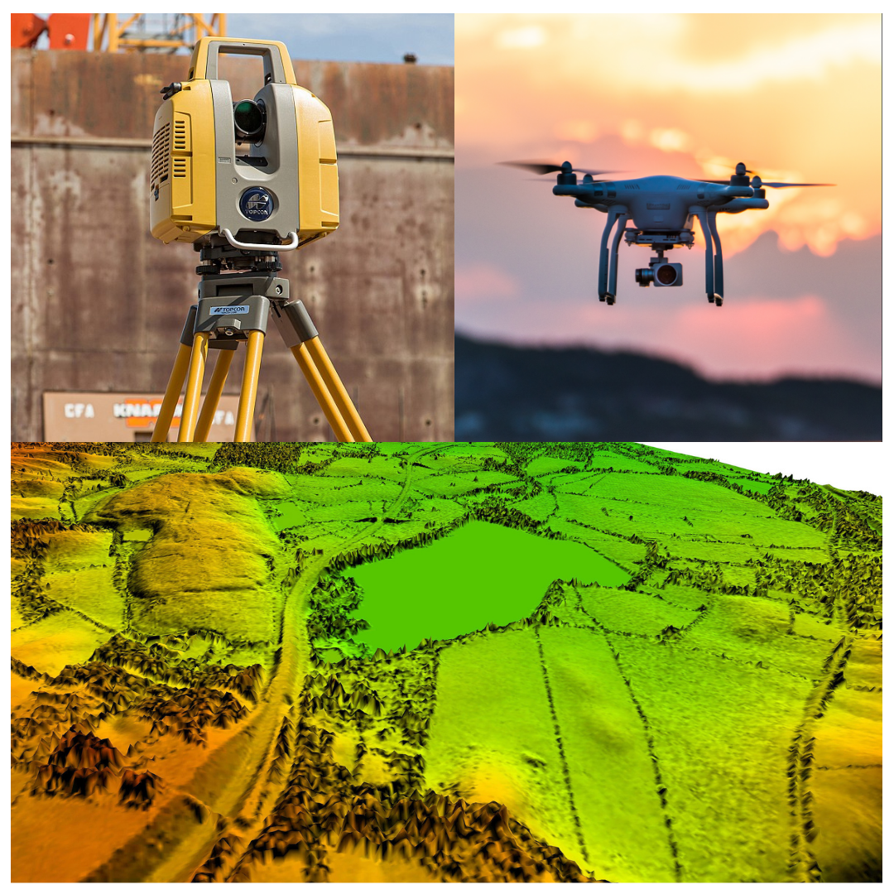
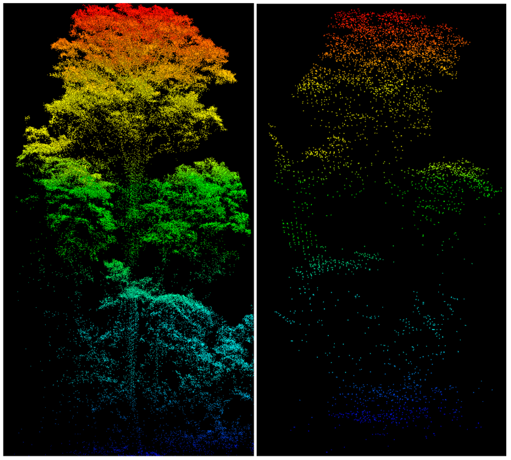

# What is Lidar?

.pull-left[
 Lidar advanced rapidly after the invention of the laser in 1960.

 A variety of lidar technologies have been developed to provide atmospheric and surface properties during the last 60 years to support advancements in digital models of terrain, cryospheric discovery, terrestrial ecology, hydrology, atmospheric science, and oceanography. 
]
.pull-right[
```{r, echo=FALSE, out.width='95%', fig.align='center'}

```
]
---
# How does Lidar work?

.pull-left[
* An active remote sensing technology

* Measuring the roundtrip time of a laser pulse

* High intensity which can penetrate through leaves

* Work in any wavelength

For instance, if a footprint contains a tree, the first returned signal will be from the top of the canopy, then the lower branches, and finally from the trunk or the ground, producing a vertical profile (discrete or continuous).
]
.pull-right[
```{r, echo=FALSE, out.width='100%', fig.align='center'}

```
]
---
# How does Lidar work?
Lidars rely on an accurate positioning system (usually RTK-GPS) to first calculate their own location and then that of the points in footprints. In terms of scanning, lidars work similarly to the line scanner and point scanner sensors. As a result, the distance of footprints on the ground in the x and y direction depends on the platform's forward speed and angular step between consecutive laser shots.

In low altitude lidar applications, i.e., sUAS platforms, footprints might overlap, generating millions of accurately georeferenced points from the scanned area called point cloud or mass points. The point cloud can be used to extract accurate physical characteristics of the objects in the area, such as plants' volume and height.

At higher altitudes, however, footprints neither overlap nor form a point cloud, but they form a grid of footprints with cross-track and along-track distances.

---
# Researches utilizing Lidar

## Multispectral LiDAR Data for Land Cover Classification of Urban Areas (Salem, 2017)

The research employs two main classification techniques: image-based and point-based. The image-based classification converts LiDAR intensity and height data into images, using band combinations of combined three-intensity images and combined three-intensity images with Digital Surface Model (DSM). The point-based classification involves combining 3D LiDAR points from the three channels and assigning three intensity values to each point as a preprocessing step. Ground filtering and the computation of Normalized Difference Vegetation Index (NDVI) values followed, with threshold values estimated using the Jenks optimization method to classify the points into the four land cover classes. 

---
# Researches utilizing Lidar

## Minute-Scale Forecasting of Wind Power—Results from the Collaborative Workshop of IEA Wind Task 32 and 36 (Ines, 2019)

The article reviews the state-of-the-art in minute-scale forecasting, emphasizing the role of LiDAR and other remote sensing devices in improving forecast accuracy. Scanning LiDAR-based propagation models are particularly noted for their potential in forecasting wind power output minutes ahead of time by providing high-resolution spatial and temporal previews of the upstream wind field. These models measure the wind speed several kilometers upwind of a wind turbine or farm and use this data to forecast power output, thus offering a new application for LiDAR technology in wind power forecasting.

---
# Researches utilizing Lidar

## Knowledge based reconstruction of building models from terrestrial laser scanning data (Shi, George, 2009)

This paper presents an automatic method for reconstruction of building façade models from terrestrial laser scanning data. Important façade elements such as walls and roofs are distinguished as features. Knowledge about the features’ sizes, positions, orientations, and topology is then introduced to recognize these features in a segmented laser point cloud.

---
# Reflection

## The applications of Lidar

* Land Use and Land Cover Classification: LiDAR data can be used to differentiate between various surface types, such as forests, buildings, and water bodies, supporting environmental monitoring and urban planning.

* Wind Energy Forecasting: By measuring wind speed and direction with LiDAR, the accuracy of wind power forecasts can be improved, optimizing the operation of wind farms and the stability of the electrical grid.


* Building Modeling: Analyzing data obtained from ground-based LiDAR scans can automatically reconstruct facade models of buildings, including features like walls and roofs, which is particularly important for the preservation of historic buildings, urban planning, and virtual reality applications.

---
# Reflection

## The advantages of Lidar

* High Precision and Resolution: LiDAR is capable of producing high-precision spatial data with high resolution, which is crucial for detailed mapping, accurate terrain surveys, and modeling complex environments.

* Strong Penetration Capability: Especially in forested areas, LiDAR can penetrate the canopy to obtain accurate ground information, a feat difficult to achieve with many other remote sensing technologies.

* Flexibility and Wide Applicability: LiDAR systems can be deployed on airplanes, drones, satellites, or ground platforms, allowing data collection in a variety of environments and conditions.

* Low Dependence on Light Conditions: Unlike optical-based remote sensing technologies, LiDAR does not rely on external light sources, so it can collect data at night or under poor lighting conditions.

---
# References

Morsy, Salem, Ahmed Shaker, and Ahmed El-Rabbany. 2017. 'Multispectral LiDAR Data for Land Cover Classification of Urban Areas' Sensors 17, 5, 958. https://doi.org/10.3390/s17050958

Würth, Ines, Laura Valldecabres, Elliot Simon, Corinna Möhrlen, Bahri Uzunoğlu, Ciaran Gilbert, Gregor Giebel, David Schlipf, and Anton Kaifel. 2019. 'Minute-Scale Forecasting of Wind Power—Results from the Collaborative Workshop of IEA Wind Task 32 and 36' Energies 12, 4, 712. https://doi.org/10.3390/en12040712

Shi Pu, George Vosselman. 2009. 'Knowledge based reconstruction of building models from terrestrial laser scanning data' ISPRS Journal of Photogrammetry and Remote Sensing 64, 6, 575. https://doi.org/10.1016/j.isprsjprs.2009.04.001.

Hamid Jafarbiglu, Alireza Pourreza. 2022. 'A comprehensive review of remote sensing platforms, sensors, and applications in nut crops' Computers and Electronics in Agriculture 197. https://doi.org/10.1016/j.compag.2022.106844

Wang Zhien, Menenti Massimo. 2021. 'Challenges and Opportunities in Lidar Remote Sensing' Frontiers in Remote Sensing 2. https://www.frontiersin.org/articles/10.3389/frsen.2021.641723 